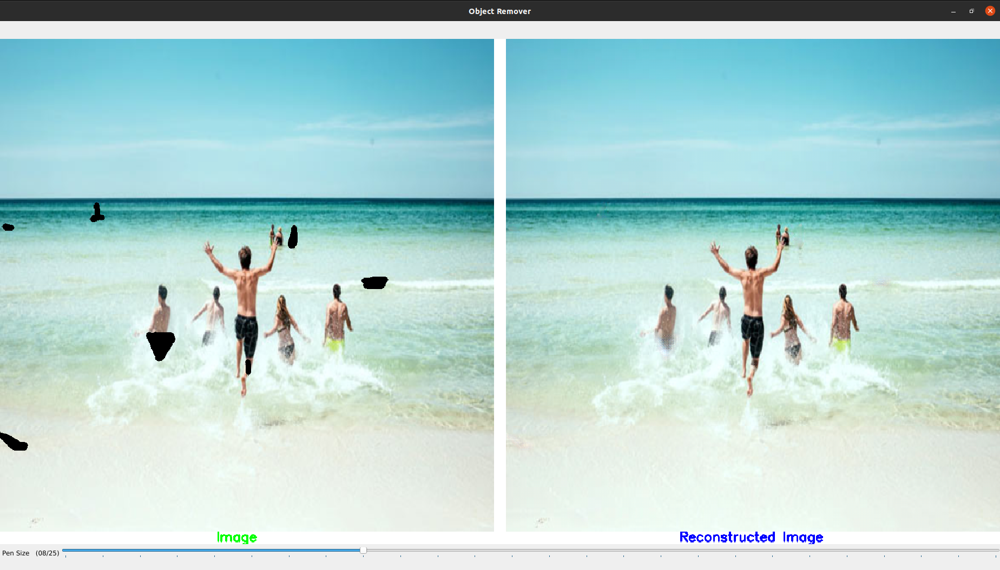
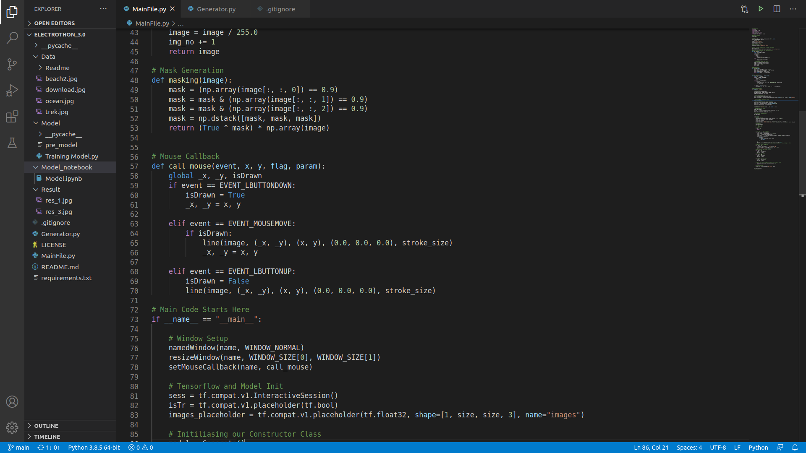

# Introduction
**Image Inpainting** is a classical problem in computer vision and graphics.  
The objective is to fill semantic and reasonable contents in the corruptions and voids to make the completre image. Humans can fill the missing regions by the empirical knowledge to the diverse
object structures from the real world.  
Nevertheless, it is not easy for machines to learn a
wide variety of structures in natural images and predict what to fill in unknown missing-data
regions in images. Thus, it is crucial to know how to learn an image transformation from a
corrupted image with missing data to a completed image.  
The current prototype is based on the following Research Paper: [Stanford Paper Link](http://stanford.edu/class/ee367/Winter2018/fu_guan_yang_ee367_win18_report.pdf) 
[Link to DataSet](https://content.alegion.com/datasets/coco-ms-coco-dataset)

# Object Removal using cGANs
This project tries to achieve object removal from images and get the base image reconstructed based on surrounding pixels(objects and colours) using conditional **Generative Adversarial Networks** (cGANs).

### 🛠 &nbsp;Tech Stack
&nbsp;
&nbsp;
&nbsp;
 

### 🔭 Snapshots

Working of this Project
  

Code Example
  

### How to Use:
Step 1: Install all the required dependencies.
  
Step 2: Open the **Main.py** file on your code editor and run it.
  
Step 3: Use the following Hot Keys to navigate through the UI:
 
 **[A] Key**          : Moves to next Image.
  
 **[D] Key**          : Moves to previous Image.
  
 **[Esc] Key**        : Close the Windowed Application.
   
Step 4: Use the bottom bar to increase or decrease the pen size and select the part of image to remove by dragging the mouse over them(just like painting).
  
Step 5: Then use the following hot keys as per the requirement: 
 
 **[F] or[Enter] Key**: Applies the filter, removes the selected the elements and displays the resulting image on right panel.
  
 **[R] Key**          : Resets the masked Image to Original(undo all the masking).
  
 **[S] Key**          : Save the resulting image.
 
